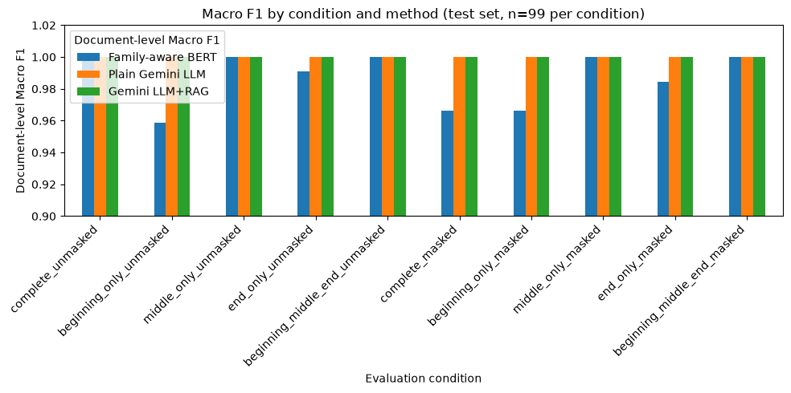
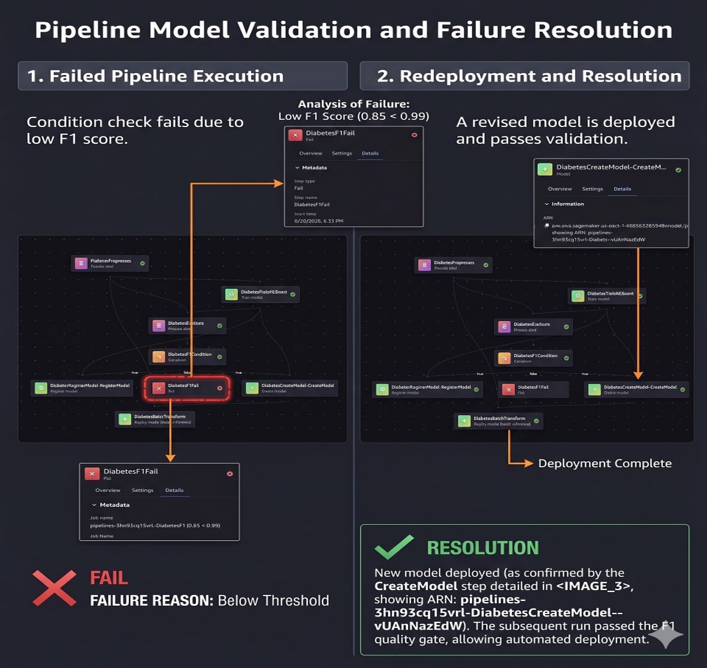
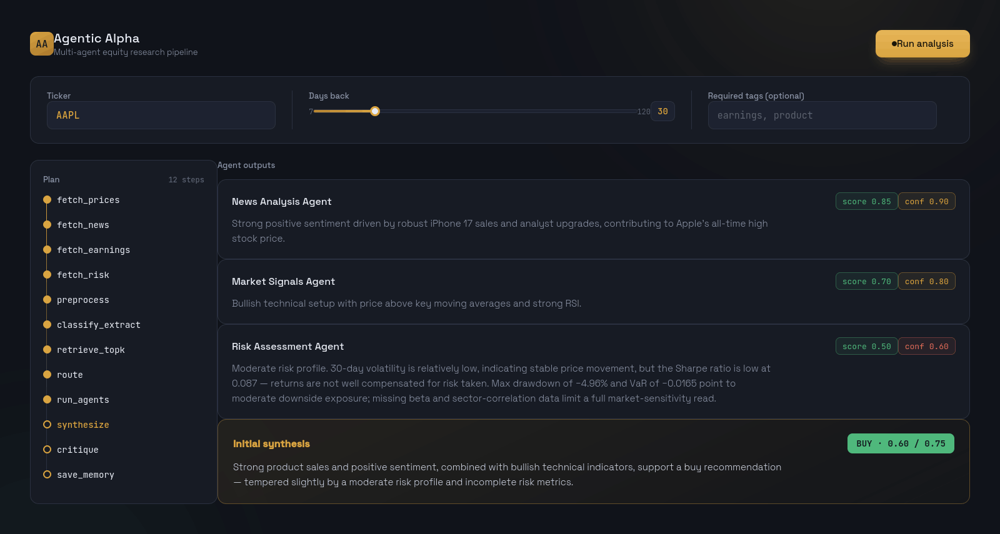

# Hi, I'm Ali Azizi 👋

**M.S. in Applied Artificial Intelligence (4.00 GPA) · Software engineering background**

## About me

I build applied AI systems across **agentic workflows, document intelligence, computer vision, NLP, and MLOps**. My work combines an M.S. in Applied Artificial Intelligence with prior software-engineering experience, allowing me to move from data preparation and model evaluation to APIs, interfaces, testing, and deployment-oriented pipelines.

- 🔭 Building privacy-aware, useful AI systems from research prototypes
- 🧠 Interested in LLM agents, RAG, model evaluation, computer vision, and reliable ML systems
- 🛠️ Comfortable connecting models to backend services, user interfaces, databases, and cloud workflows
- 🎯 Open to **Machine Learning Engineer** and **Applied AI Engineer** opportunities

## Featured work

### 🧭 [NewStart AI — Newcomer Navigator](https://github.com/al1az1z1/newstart-ai)

Team research platform for understanding and routing U.S. government documents to agency-specific services. It compares fine-tuned BERT, Gemini, and Gemini with RAG using a family-aware split designed to reduce leakage between related document versions.

`BERT` · `Gemini` · `RAG` · `ChromaDB` · `FastAPI` · `React` · `Research Evaluation`

- Evaluated three methods on **99 family-disjoint test documents**, ten masked/unmasked conditions, and **2,970 total cases**
- All three methods reached **1.000 accuracy and macro-F1** on the primary complete-unmasked condition
- Includes a self-contained research MVP, frozen artifacts, safe rerun controls, and **85 automated tests**

  

### 🚗 [Traffic Vehicle Detection, Tracking & Behavior Analysis](https://github.com/GitAIwithMike/vehicle-behavior-analysis-framework)

Team-built, CPU-friendly computer-vision pipeline using **YOLO11** and a custom IoU tracker to detect vehicles, maintain identities, extract trajectories, and flag sudden stops, lane-change-like motion, and tailgating. I contributed YOLO11 model-comparison work and project documentation.

`YOLO11` · `OpenCV` · `Object Tracking` · `Trajectory Analysis` · `Behavior Detection`

<!--  8–12 seconds of annotated traffic output as
assets/yolo11-traffic-demo.gif-->

  

### 🤖 [Diabetes Readmission MLOps](https://github.com/al1az1z1/AAI-540-Diabetes-Readmission-MLOps)

Team-built AWS SageMaker pipeline covering S3/Athena ingestion, feature engineering, XGBoost training, evaluation, an F1 quality gate, model registration, batch inference, and CloudWatch monitoring. I worked as the **MLOps Engineer**.
`LLM Agents` · `Prompt Chaining` · `Routing` · `Evaluator–Optimizer` · `Python` · `Gradio`

### 🤖 [Agentic Finance](https://github.com/al1az1z1/agentic-finance)

Multi-agent financial-analysis system coordinating news, earnings, market-signal, risk, synthesis, and critique agents. I worked as the **System Engineer and UI/Integration Lead**, contributing orchestration, agent/API integration, and the Gradio interface.

`LLM Agents` · `Prompt Chaining` · `Routing` · `Evaluator–Optimizer` · `Python` · `Gradio`

## More machine-learning work

| Project | What it demonstrates |
|---|---|
| 🎼 **[Composer & Genre Classification](https://github.com/al1az1z1/composer-prediction-project)** | Deep-learning comparison using LSTM note sequences and CNN spectrograms to classify music by composer. |
| 📈 **[Stock Movement Prediction](https://github.com/al1az1z1/stock-prediction)** | Time-aware feature engineering and logistic-regression experiments for next-day direction prediction across technology stocks. |
| 💬 **[Sentiment Analysis](https://github.com/MohammadA98/SentimentLabelledSentences)** | Collaborative VADER-versus-logistic-regression study; I contributed data validation, text cleaning, tokenization, preprocessing, and model-evaluation work. |

<!-- OPTIONAL IMAGE: The MLOps repository already contains screenshots/architecture.png.
To feature it here, copy the preferred image into this profile repository as
assets/sagemaker-pipeline.png, then add an  block beneath the table.
-->

## Technical toolkit

**AI & machine learning**  

**Agents, applications & data**  

`LLM agents` · `RAG` · `BERT` · `YOLO11` · `ChromaDB` · `SageMaker` · `MLOps` · `REST APIs`

## GitHub activity

  

  

> Language statistics describe public repository contents; they are not a measure of proficiency.

---

### Let's build AI that is useful, testable, and responsible.

[View my repositories](https://github.com/al1az1z1?tab=repositories) · [Connect on LinkedIn](https://www.linkedin.com/in/al1az1z1/) · [Email me](mailto:azizi.ali87@gmail.com)

